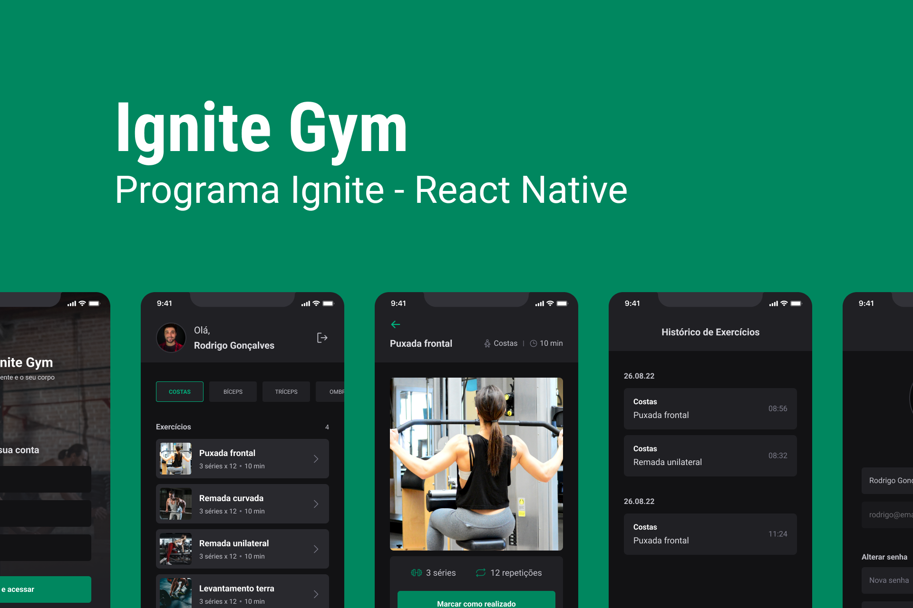

<h1 align="center"> ignite Gym </h1>

APP desenvolvido na trilha de React Native

  <a href="#-tecnologias">Tecnologias</a>&nbsp;&nbsp;&nbsp;|&nbsp;&nbsp;&nbsp;
  <a href="#-projeto">Projeto</a>&nbsp;&nbsp;&nbsp;|&nbsp;&nbsp;&nbsp;
<!--   <a href="#-layout">Layout</a>&nbsp;&nbsp;&nbsp;|&nbsp;&nbsp;&nbsp; -->
  <a href="#-layout">Executando</a>&nbsp;&nbsp;&nbsp;|&nbsp;&nbsp;&nbsp;
  <a href="#memo-licença">Licença</a>

  

  

 

## 🚀 Tecnologias

Esse projeto foi desenvolvido com as seguintes tecnologias:

- Reac Native
- Git e Github
- TypeScript
- Gluestack
- Async Storage
- react-hook-form

## 💻 Projeto

O objetivo do projeto é criar um app que seja possível registrar os exercícios que voce fez. Tem histórico dos exercícios.

## 🛠️ Telas

### Home

### Históricos de exercícios

### Tela de exercício separado por grupo

### Tela de perfil do usuário

## :memo: Licença

Esse projeto está sob a licença MIT.

---
